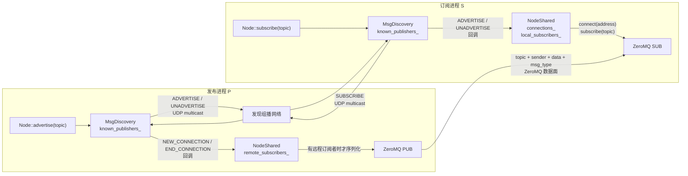
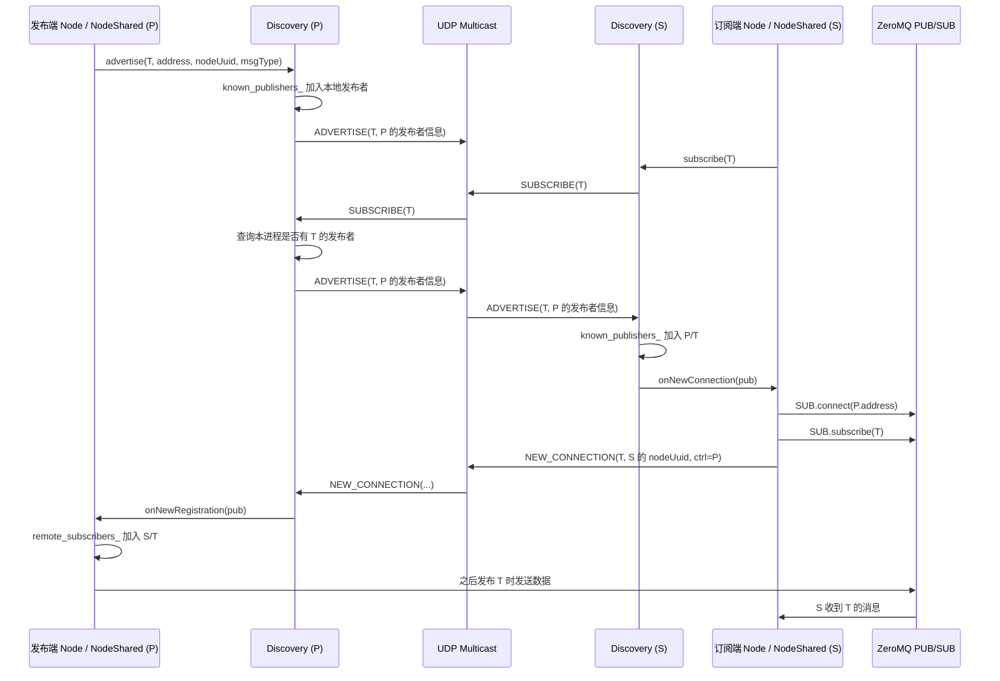

# NodeShared 与 Discovery 发现机制

本项目将发现和实际数据传输分为两层：

- `Discovery<MessagePublisherInfo>`：通过 UDP 组播传播发现协议，维护已知发布者，并触发回调。
- `NodeShared`：将发现回调转为 ZeroMQ 的 `SUB` 连接、主题过滤，以及发布端的远程订阅者记录。
- 数据本身不走发现组播，而是由发布端 `PUB` socket 发给订阅端 `SUB` socket。

`NodeShared` 在构造时将消息发现器的四类回调分别绑定到 `onNewConnection`、`onNewDisconnection`、`onNewRegistration`、`onEndRegistration`，见 [src/node_shared.cc](../src/node_shared.cc#L71)。



以下以进程 `P` 发布 `topic=T`、进程 `S` 订阅 `T` 为例，展示完整的发现与连接建立过程。



## 消息职责

| 消息 | 发起时机 | `Discovery` 的处理 | `NodeShared` 的实际动作 |
| --- | --- | --- | --- |
| `ADVERTISE` | `Node::advertise()`，收到 `SUBSCRIBE` 后的应答，或心跳重播 | 将发布者加入 `known_publishers_`，首次加入时触发 `connection_cb` | 订阅端连接发布端 `address`，添加 ZeroMQ topic filter，并发出 `NEW_CONNECTION` |
| `UNADVERTISE` | 本地发布者被 `Discovery::unadvertise()` 移除 | 从 `known_publishers_` 删除该发布者，触发 `disconnection_cb` | 订阅端从 `connections_` 删除对应记录 |
| `SUBSCRIBE` | `Node::subscribe()` 调用 `discover(topic)` 时 | 本进程若有匹配 topic 的发布者，则重发该发布者的 `ADVERTISE` | 不直接建立订阅记录；它只是一次“谁能提供这个 topic”的即时查询 |
| `NEW_CONNECTION` | 订阅端收到远端 `ADVERTISE` 并完成本地 `SUB` 连接后；每个本地订阅 Node 一条 | 触发 `registration_cb` | 目标发布进程验证 `ctrl == process_uuid_`，然后将远端订阅者加入 `remote_subscribers_` |
| `END_CONNECTION` | `Node::unsubscribe()` 时，针对已知的发布者进程发送 | 触发 `unregistration_cb` | 目标发布进程按 `topic + 订阅进程 UUID + node UUID` 从 `remote_subscribers_` 移除记录 |

## `ADVERTISE` 与 `NEW_CONNECTION` 的区别

```text
ADVERTISE:
  “我 P 可以发布 topic T，数据地址在 address。”

NEW_CONNECTION:
  “我 S 上的某个 Node 已订阅 T；这条登记消息专门发给 P。”
```

`NEW_CONNECTION` 并不代表建立了一条新的 TCP 或 UDP 连接。真正的传输连接在订阅端收到 `ADVERTISE` 时由 `NodeShared::onNewConnection()` 发起：

```cpp
subscriber_->connect(addr.c_str());
subscriber_->set(zmq::sockopt::subscribe, topic);
```

随后订阅端将“本地订阅者是谁”写入 `NEW_CONNECTION`，并通过 `ctrl` 字段指定目标发布进程。发布端的 [onNewRegistration](../src/node_shared.cc#L241) 会忽略 `ctrl` 不等于自身进程 UUID 的组播消息，只有真正的目标发布者会将该远端订阅者写入 `remote_subscribers_`。

发布数据时，[Publisher::publishImpl](../src/publisher.cc#L44) 先查询 `remote_subscribers_`。只有存在对应 `topic` 和消息类型的远端订阅者，才会序列化并调用 `NodeShared::publish()` 发送 ZeroMQ 数据。因此 `NEW_CONNECTION` 是发布端“是否需要向远端发送数据”的逻辑登记。

## 注销与故障恢复

`END_CONNECTION` 是订阅者主动取消订阅时的精确注销。它由 [Node::unsubscribe](../src/node.cc#L111) 对每个已知发布端进程发送，发布端收到后删除对应的远端订阅记录。

`UNADVERTISE` 是发布者主动撤销“我提供这个 topic”的声明。远端发现器会删除该发布者记录并通知 `NodeShared`。当前实现的 `onNewDisconnection()` 会从 `connections_` 移除记录，但没有显式调用 ZeroMQ `disconnect()`；连接的实际关闭依赖 socket 生命周期或底层行为，逻辑上则已经不再把该发布者视为已发现对象。

发现机制还通过以下消息维持最终一致性：

- 默认每 `1000 ms` 发送 `HEARTBEAT`，并重新发送本进程所有 `ADVERTISE`。
- 默认每 `200 ms` 检查活动状态。
- 默认 `3000 ms` 未收到某进程任何发现消息，就删除该进程的发布者记录并触发断开回调。
- `Discovery` 析构时发送 `BYE`，可让其他进程尽快清理其发布与订阅相关状态。

这些默认值定义在 [include/trans/details/discovery.hpp](../include/trans/details/discovery.hpp#L86)。因此即使启动顺序使首次 `ADVERTISE` 或 `SUBSCRIBE` 没有形成匹配，后续重播的 `ADVERTISE` 也会让订阅端恢复发现。
